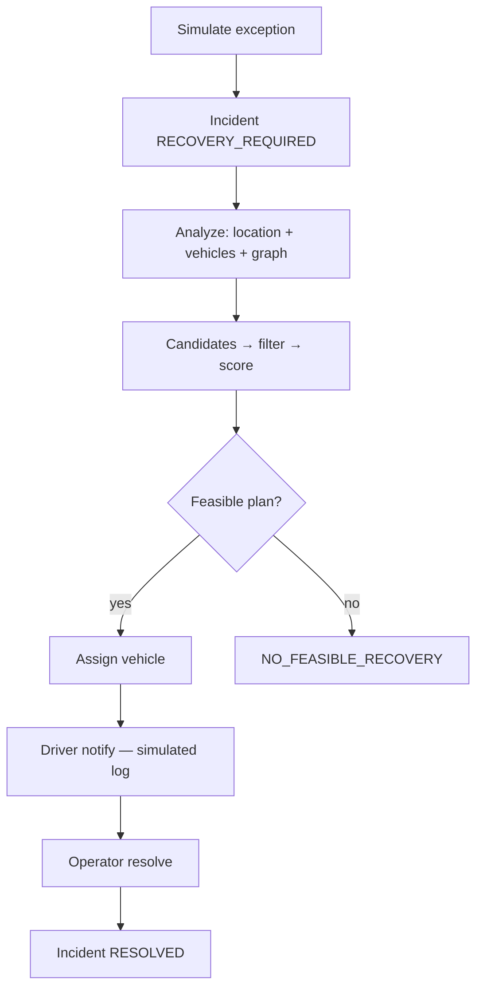
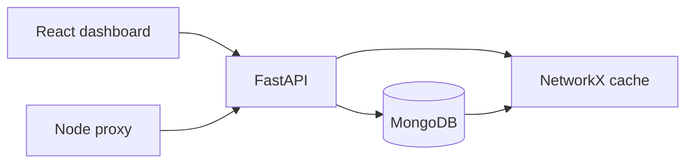

# SH-205 — Intelligent Shipment Piggybacking

Hackathon prototype that turns a shipment **exception** into an **actionable piggyback recovery plan**: find where the shipment can be recovered, which existing active vehicle/route can carry it toward its destination, assign that vehicle, and (in the demo) notify the driver.

> Existing logistics systems can detect shipment exceptions. This prototype focuses on recovery after the exception — not on inventing a new tracking stack.

---

## Problem

A shipment is flagged as misplaced, delayed, or otherwise needing recovery. Creating an entirely new transport movement is expensive and slow. Instead, the system searches the **existing logistics network** for vehicles already in motion (or available) that can pick up the shipment and continue toward its destination within the deadline.

**Piggybacking** means using an already active / in-network vehicle movement to recover and transport the shipment, rather than dispatching a dedicated new run.

The prototype does **not** physically track packages, infer exact lost-package GPS coordinates, or detect physical loss without shipment/event data. For the hackathon, shipment and vehicle events are **simulated**.

---

## What is different

This table describes **our prototype’s focus**, not a claim that every logistics system lacks these capabilities.

| Existing capability | Our focus |
| --- | --- |
| Shipment visibility | Recovery after an exception |
| Exception detection | Expected vs actual hub mismatch + recovery from **actual** hub |
| Tracking / alerts | Candidate vehicle / route generation |
| Normal route planning | Piggyback recovery on existing movements |
| Operator notification | Driver assignment + contact (simulated) |
| Exception information | Actionable ranked recovery plan |

---

## End-to-end demo lifecycle

```text
Shipment Exception
       ↓
Incident Created
       ↓
Compare expected hub (planned route)
   vs actual / last-confirmed hub
       ↓
actualNode ≠ expectedNode → MISPLACED
       ↓
Recovery pickup = actual hub
       ↓
Find Active Vehicles & Existing Routes
       ↓
Generate Piggyback Candidates
       ↓
Feasibility Filter
       ↓
Weighted Recovery Score
       ↓
Select Vehicle + Driver
       ↓
Contact Driver
       ↓
Driver Confirms Pickup
       ↓
Shipment Recovered
       ↓
Piggyback on Existing Route
       ↓
Destination
       ↓
Incident Resolved
```

| Step | What happens in this prototype |
| --- | --- |
| Shipment exception | Operator (or demo) marks a shipment as needing recovery via `POST /api/incidents/simulate` — simulated `MISPLACED_SHIPMENT`. |
| Incident created | MongoDB `incidents` row (`RECOVERY_REQUIRED`) + shipment `status: misplaced`. |
| Expected vs actual | **`expectedNode`** = next/current hub from `assignedRoute` (origin → stops → destination) advanced by on-route `shipmentevents`. **`actualNode`** = last-confirmed hub from `currentLocation` → `Location.graphNodeKey`. Misplaced when both are known and they differ. Not live GPS. |
| Recovery location | **Actual** misplaced hub (pickup node). Never assume last-known location is the destination or the expected hub. |
| Active vehicles / routes | Vehicles with status `available` / `in_transit` / `loading`, residual capacity, and a known graph node; routes used for baselines / context. |
| Generate candidates | `at_node`, `pass_through`, `detour` (see below). |
| Feasibility filter | Capacity, reachability, deadline (hard), detour ratio. |
| Weighted score | Deterministic weighted sum — not ML. |
| Select vehicle | Highest-scoring feasible candidate (`selectedRecovery`). |
| Contact driver | On assign: message built and **logged** (`channel: log`). No real telephony. |
| Driver confirms pickup | **Not a separate API.** Demo skips to operator “resolve”. |
| Shipment recovered | `POST /api/recovery/:id/resolve` → shipment `recovered`, incident `RESOLVED`. |
| Piggyback / destination | Conceptual outcome of the selected path; physical transit is not telematics-driven in this prototype. |



---

## Expected vs actual location

Recovery analysis distinguishes two hubs (see `graph/shipment_state.py`):

| Term | Meaning | Source |
| --- | --- | --- |
| **expectedNode** | Where the shipment **should** be per plan | Derived from `assignedRoute` (origin → sequenced `stops[]` → destination) advanced by on-route `shipmentevents` (arrival keeps the hub; departure advances to the next). `Shipment.expectedLocation` is a persisted cache of that derivation (`sync_expected_location`), not an arbitrary static input. |
| **actualNode** | Where it was **last confirmed** | Latest location-confirming `shipmentevents`, else `Shipment.currentLocation` → `Location.graphNodeKey`. Never overwritten just because the route says the shipment should be elsewhere. |

```text
Expected route
      ↓
Expected next/current hub
      ↓
Compare with actual/last-confirmed hub
      ↓
actualNode != expectedNode
      ↓
MISPLACED_SHIPMENT
      ↓
actualNode becomes recovery/pickup node
      ↓
Find active vehicles that can pick it up
      ↓
Find piggyback route toward destination
```

**Minimum data to compute `expectedNode`:** `assignedRoute` with resolvable origin/destination (and optional sequenced `stops`) via `graphNodeKey`. Without a planned route, expected stays unknown — do not invent a hub from a static field alone. Falls back only to explicit `status` / `misplaced` events for recovery flags; `currentLocation` alone never means misplaced.

Status/event flags (`status: misplaced`, event type `misplaced`) still force recovery when the plan is incomplete.

---

## What constitutes a candidate

Implemented in `graph/candidate_generator.py`. Pickup is always the **actual** hub. For each capable vehicle:

1. **`at_node`** — vehicle is already at the shipment’s **actual** recovery/pickup node.
2. **`pass_through`** — pickup lies on the vehicle’s **existing `currentRoute`** (origin → stops → destination) toward a compatible destination. A shortest-path visit alone is **not** pass_through.
3. **`detour`** — vehicle must divert from its current position/route to the pickup node, then continue toward destination, only if detour distance ≤ `max_detour_ratio` × baseline (existing route length when known, else vehicle→destination; default **3.0**).

Preferred cases are already-compatible movements (`at_node`, `pass_through`); **`detour` is a fallback**. Candidates carry driver identity (vehicle handle), existing route facts, pickup/destination paths, capacity, and a rough deadline flag for the scorer.

---

## Recovery feasibility

Hard constraints (infeasible candidates are rejected, not merely down-ranked):

- Sufficient residual **weight** and **volume** capacity
- Required NetworkX paths must exist (vehicle → pickup when needed; path supporting destination reachability)
- Vehicle can reach the pickup / recovery node
- Estimated delivery must meet the shipment **deadline** (deadline miss = hard reject)
- Detour candidates must satisfy the configured **maximum detour ratio**

Deadline is a **hard constraint**, not only a soft scoring preference. Among feasible candidates, remaining deadline buffer still contributes to the score.

---

## Recovery scoring

Implemented in `graph/recovery_scorer.py`. No ML model.

**Total score**

```text
Total Score = Σ(weight × normalized component score)
```

**Default weights**

| Component | Weight |
| --- | --- |
| time | 0.25 |
| cost | 0.15 |
| capacity | 0.15 |
| deadline | 0.20 |
| priority | 0.10 |
| detour | 0.10 |
| connectivity | 0.05 |

**Cost proxy:** `distance_km × ₹28/km`  
Prototype only — graph edges currently have no INR cost attribute.

**Connectivity:** degree and degree-centrality of the pickup hub in the NetworkX graph (prefer well-connected hubs).  
**Detour component:** prefers less additional movement. Uses the vehicle’s `currentRoute` baseline when present; otherwise uses piggyback facts (`at_node` / `pass_through` → no extra km, `detour` → diversion distance). Missing baselines are never invented. Connectivity remains a softened minor tie-breaker.

Analysis responses use `status`: `RECOVERY_PLAN_AVAILABLE` | `NO_FEASIBLE_RECOVERY`.

---

## Recovery assignment and driver interaction

```text
Selected Vehicle
      ↓
Associated Driver
      ↓
Driver Contact
      ↓
Pickup Confirmation
      ↓
Recovery Event
```

| Step | Implementation status |
| --- | --- |
| Select vehicle | **Implemented** — orchestrator / assign API |
| Associated driver | Vehicle identity used as notification target (no separate driver entity API) |
| Driver contact | **Simulated** — `graph/services/driver_communication.py` logs the assignment message (`delivered: true`, `channel: "log"`) |
| Pickup confirmation | **Not implemented** as its own step/API |
| Recovery event | **Partial** — assign writes `shipmentevents` (`recovery_started`); resolve writes `recovered` |

The intended product meaning of contact: the driver is asked to **physically retrieve the misplaced shipment and carry it toward the destination on the selected piggyback route**. In the hackathon build, that contact is a **log stub**, and “pickup confirmed → recovered” is completed by the operator via **resolve**.

---

## Incident state lifecycle

### Persisted incident statuses (`Incident` model)

```text
OPEN | RECOVERY_REQUIRED | ASSIGNED | RESOLVED
```

Demo simulate path typically uses `RECOVERY_REQUIRED` → `ASSIGNED` → `RESOLVED`.

### Computed demo lifecycle (`lifecycleStatus`)

Derived from shipment + incident (see `incident_service._lifecycle_status`):

```text
NORMAL → MISPLACED → RECOVERY_ANALYSIS → RECOVERY_ASSIGNED → RECOVERED
```

`RECOVERY_ANALYSIS` appears when an active incident has `analysisStatus == RECOVERY_PLAN_AVAILABLE`.

### Preferred conceptual lifecycle (not all implemented)

```text
DETECTED → ANALYZING → ASSIGNED → DRIVER_CONTACTED
→ PICKUP_PENDING → RECOVERED → IN_TRANSIT → DELIVERED → RESOLVED
```

States such as `DRIVER_CONTACTED`, `PICKUP_PENDING`, `IN_TRANSIT`, and `DELIVERED` are **not** separate persisted statuses today — see Future improvements.

---

## Architecture

```text
React / Vite (:5173)
        ↓  HTTP JSON
Node.js proxy (:3000)          ← optional thin proxy
        ↓
FastAPI + Uvicorn (:5055)      ← recovery business logic
        ↓
MongoDB                        ← source of truth
        ↓
NetworkX DiGraph (in-memory)   ← path / weight computation
```

| Layer | Responsibility |
| --- | --- |
| MongoDB | Source of truth for ops + Telangana network tables |
| NetworkX | In-memory graph compute only (not persisted) |
| Python (`graph/`) | Recovery analysis, scoring, incident workflow |
| Node.js | Thin `/api/*` proxy to FastAPI |
| React | Operator UI: map, simulate, analyze, assign, resolve |



---

## Module responsibilities

| Module | Responsibility |
| --- | --- |
| `graph/shipment_state.py` | Resolve shipment + locations → **expected vs actual** graph nodes / recovery flags |
| `graph/vehicle_state.py` | Active vehicles + residual capacity + graph nodes |
| `graph/recovery_context.py` | Combine shipment, vehicles, routes, and graph facts (pickup = actual) |
| `graph/candidate_generator.py` | Generate raw piggyback candidates |
| `graph/recovery_scorer.py` | Feasibility + weighted scoring + selection |
| `graph/recovery_orchestrator.py` | End-to-end `analyze_shipment_recovery` |
| `graph/incident_service.py` | Simulate / assign / resolve (incident hub = actual) |
| `graph/services/driver_communication.py` | Driver notification integration point (log stub) |
| `graph/graph_cache.py` | Cached NetworkX graph |
| `graph/graph_builder.py` | Build DiGraph from MongoDB nodes/edges |
| `graph/api_server.py` | FastAPI routes |
| `graph/api_services.py` | Batch Mongo reads for hubs/vehicles/shipments/graph |
| `src/services/recoveryProxy.js` | Node → Python HTTP proxy |

### Planned modules (not present as separate files)

| Planned | Notes |
| --- | --- |
| `assignment_service.py` | Assignment currently lives in `incident_service.assign_recovery` |
| `driver_contact_service.py` | Stub lives under `graph/services/driver_communication.py` |
| `recovery_event_service.py` | Events written inline on assign/resolve |

---

## API surface

Implemented FastAPI routes (Node proxies the same paths when used):

| Method | Endpoint | Purpose |
| --- | --- | --- |
| `GET` | `/api/health` | MongoDB + graph health |
| `GET` | `/api/hubs` | Operational locations |
| `GET` | `/api/graph` | Telangana topology for map |
| `GET` | `/api/vehicles` | Vehicle list + capacity/location |
| `GET` | `/api/vehicles/{vehicleId}` | Vehicle detail + shortest path when available |
| `GET` | `/api/shipments` | Dashboard shipment list |
| `GET` | `/api/shipments/{shipmentId}` | Detail + recent events + active incident |
| `GET` | `/api/recovery/{shipmentId}` | Full recovery analysis |
| `POST` | `/api/recovery/{shipmentId}/calculate` | Same analysis (explicit calculate) |
| `POST` | `/api/recovery/analyze/{shipmentId}` | Same analysis (explicit analyze) |
| `POST` | `/api/recovery/{shipmentId}/assign` | Assign candidate + simulated driver notify |
| `POST` | `/api/recovery/{shipmentId}/resolve` | Mark recovered / resolve incident |
| `POST` | `/api/recovery/graph/refresh` | Rebuild in-memory NetworkX graph |
| `POST` | `/api/incidents/simulate` | Simulate misplaced incident on existing shipment |
| `GET` | `/api/incidents/active` | Active incidents for alerts |
| `GET` | `/api/incidents/by-shipment/{shipmentId}` | Latest incident for a shipment |

There is **no** separate driver-contact or pickup-confirmation endpoint; contact is embedded in **assign**.

---

## Data model

| Collection / model | Role |
| --- | --- |
| `shipments` | Package identity, status, deadline, current/destination locations |
| `vehicles` | Capacity, load, status, current location, current route |
| `routes` | Planned movement + embedded stops; distance/duration baselines |
| `locations` | Operational hubs; **`graphNodeKey`** joins to the graph |
| `incidents` | Demo exception lifecycle + assignment snapshot |
| `shipmentevents` | Simulated tracking / recovery event history |
| `recoverycases` / `recoveryoptions` | Schemas exist; scorer does **not** auto-persist scored options yet |
| `telangana_nodes` | Graph hubs (`hub_name`, lat/lon, type) |
| `telangana_edges` | Directed legs (`avg_distance_km`, `avg_time_min`) |

**Operational ↔ graph bridge:** `Location.graphNodeKey` = `telangana_nodes.hub_name`. That string is the join key used by recovery analysis.

---

## Graph model

- **Type:** NetworkX `DiGraph` (directed logistics legs)
- **Nodes:** hubs from `telangana_nodes` (`hub_name`)
- **Edges:** `telangana_edges` with `avg_distance_km`, `avg_time_min`
- **Join:** `Location.graphNodeKey`
- **Network:** Telangana logistics prototype graph

**This prototype does not use H3.** Spatial identity is hub lat/lon + graph routing, not hexagonal indexing.

---

## Demo scenario

City-level story:

```text
Expected:
Hyderabad → Siddipet → Karimnagar

Actual:
Hyderabad → Nizamabad  ← misplaced

Nizamabad = recovery/pickup node
        ↓
Find existing Nizamabad → Karimnagar vehicle/route
        ↓
Piggyback shipment
        ↓
Karimnagar
```

The observed Telangana topology CSV has **no Siddipet / Nizamabad hubs**, so the seeded demo maps that story onto existing graph nodes:

| Story city | Graph hub used |
| --- | --- |
| Hyderabad | `Hyderabad_Shamshbd_H (Telangana)` |
| Siddipet (expected next) | `Medchal_MROoffce_D (Telangana)` |
| Karimnagar | `Karimnagar_KamnHbRD_I (Telangana)` |
| Nizamabad (actual / pickup) | `Kamareddy_Devenply_I (Telangana)` |

`Kamareddy → Karimnagar` already exists as a directed edge, so piggyback candidates can use `at_node` / `pass_through` without inventing topology.

```bash
npm run seed:demo-misplaced          # insert SHP-DEMO-MISPLACED
npm run test:expected-actual         # helper + seed checks
npm run recovery:demo -- SHP-DEMO-MISPLACED
```

```text
Shipment SHP-DEMO-MISPLACED
Planned: Hyderabad_Shamshbd_H → Medchal_MROoffce_D → Karimnagar_KamnHbRD_I
Expected next: Medchal_MROoffce_D
Actual / last confirmed: Kamareddy_Devenply_I
        ↓
MISPLACED (actual ≠ expected)
        ↓
Recovery pickup = Kamareddy_Devenply_I
        ↓
Candidate vehicles (at_node / pass_through / detour) toward Karimnagar
        ↓
Assign → driver notification logged (simulated)
        ↓
Operator resolve → shipment recovered
```

---

## Technology stack

| Area | Tech |
| --- | --- |
| UI | React, Vite, Leaflet / react-leaflet |
| Proxy | Node.js (ESM) |
| API | FastAPI, Uvicorn |
| Graph | NetworkX |
| DB | MongoDB, Mongoose, PyMongo |
| Schemas | TypeScript (`src/models`) |
| Python tooling | uv, python-dotenv, pandas, pyvis, geopy (scripts / graph prep) |

---

## Limitations / prototype assumptions

- Shipment and vehicle events are **simulated**
- No physical scanners / RFID
- No live GPS / telematics integration driving recovery location
- **expectedNode** requires `assignedRoute` (+ optional stops/events); without it, mismatch detection is unavailable
- Recovery pickup = **actual** last-confirmed hub in MongoDB, not the planned expected hub and not automatic lost-package localization
- Cost is a **₹/km proxy**
- Score is **deterministic / weighted**, not ML
- Graph is a **prototype Telangana** network (demo city names may map to nearest existing hubs)
- Driver communication is a **log stub**
- Pickup confirmation and mid-transit telematics states are **not** full product workflows yet
- Scored recovery options are **not** auto-written to `recoveryoptions`

---

## Future improvements

- Real carrier / WMS / TMS exception feeds
- GPS / telematics for vehicle position
- Real transportation edge costs
- Historical route / success probabilities
- ML-based recovery probability (optional)
- Richer capacity and handling constraints
- Real telephony / SMS for driver contact
- Explicit pickup-confirmation and in-transit states
- H3 / proximity indexing if hub-graph search is insufficient
- Persist scored options into `recoveryoptions` with aligned score fields

---

## Run (local)

```bash
npm run recovery:api    # FastAPI :5055
npm start               # optional Node proxy :3000
npm run frontend        # React :5173 — set VITE_API_BASE_URL
npm run seed:demo-misplaced   # demo: expected ≠ actual hubs
npm run recovery:demo   # CLI orchestrator demo
npm run test:expected-actual
```

Requires `.env` with `MONGODB_URI` / `MONGODB_DB_NAME`. See [`ARCHITECTURE.md`](./ARCHITECTURE.md) for deeper module notes.
