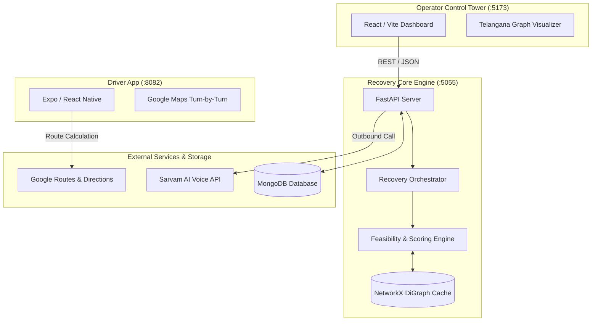

# 🚛 SH-205: Intelligent Shipment Piggybacking

> **Autonomous logistics recovery system that turns shipment exceptions into actionable in-transit piggybacking assignments across the Telangana freight network.**

---

## 📌 Executive Summary

When a high-value shipment is misplaced or delayed at a freight terminal, traditional logistics systems either wait for the next scheduled run or dispatch an expensive, ad-hoc dedicated recovery vehicle.

**Intelligent Shipment Piggybacking (SH-205)** solves this by analyzing active in-network vehicles and existing routes. It dynamically identifies passing or nearby freight trucks that have residual weight/volume capacity, reroutes them to the actual misplaced location, and piggybacks the cargo to its final destination within hard delivery deadlines.

```
Shipment Exception (Actual ≠ Expected Hub)
           │
           ▼
Telangana Logistics Graph Search (NetworkX)
           │
           ▼
Candidate Generation (at_node / pass_through / detour)
           │
           ▼
Feasibility Engine (Capacity + Hard Deadline + Max Detour)
           │
           ▼
Deterministic Weighted Scoring
           │
           ▼
Optimal Vehicle Selection & Driver Assignment
           │
     ┌─────┴─────────────────────────┐
     ▼                               ▼
Sarvam AI Outbound Call       Driver Mobile App
(Indic Voice Notification)    (Turn-by-Turn Navigation)
```

---

## 🌟 Core System Pillars

| Component | Technology | Description |
| :--- | :--- | :--- |
| **Operator Control Tower** | React, Vite, Leaflet, Tailwind | Web dashboard to monitor live shipments, visualize graph nodes/routes, inspect divergence, and trigger recovery assignments. |
| **Piggyback Intelligence Engine** | Python 3.11+, FastAPI, NetworkX | In-memory graph search that evaluates capacity, routes, detour ratios, and deadlines across 50+ Telangana logistics hubs. |
| **Driver Companion Mobile App** | Expo, React Native, Google Maps | Independent driver cockpit featuring live GPS tracking, 3D follow camera, turn-by-turn voice navigation, and recovery mission alerts. |
| **Outbound Voice Integration** | Sarvam AI Conversations API | Automated outbound phone calls in Indic languages (Telugu/Hindi/English) notifying drivers of urgent cargo recovery tasks. |

---

## 🚀 Key Features

### 1. Expected vs. Actual Hub Divergence Detection
- **`expectedNode`**: Where the package should be according to its sequenced route plan (`assignedRoute`).
- **`actualNode`**: Where the shipment was last physically confirmed through scan events (`currentLocation`).
- **Mismatch Trigger**: Automatically flags the shipment as `MISPLACED` and designates the actual hub as the pickup origin.

### 2. Piggyback Candidate Classification
- **`at_node`**: Vehicle is already stationed at the recovery pickup hub.
- **`pass_through`**: The recovery pickup hub lies directly along the vehicle’s active route.
- **`detour`**: Vehicle diverts from its planned corridor to retrieve cargo, bounded by a strict `max_detour_ratio` (default `≤ 3.0×`).

### 3. Hard Feasibility & Deterministic Scoring
- **Hard Constraints**: Rejects candidates exceeding residual weight/volume or missing the shipment deadline.
- **Multi-Factor Scoring**:
  $$\text{Score} = 0.25(\text{Time}) + 0.20(\text{Deadline}) + 0.15(\text{Cost}) + 0.15(\text{Capacity}) + 0.10(\text{Priority}) + 0.10(\text{Detour}) + 0.05(\text{Connectivity})$$

### 4. Real-Time Driver Navigation & Sarvam Voice Alert
- Dispatches notification via **Sarvam AI Instant Outbound** to call the driver in their preferred regional language.
- Mobile Driver Cockpit automatically computes the optimal two-leg route (`Current Location → Recovery Hub → Final Destination`) with interactive turn-by-turn guidance.

---

## 🏗️ Architecture



---

## 📂 Project Structure

```text
Conv-Software-Hackathon/
├── frontend/                     # Operator Web Dashboard (React + Vite + Leaflet)
│   ├── src/
│   │   ├── components/recovery/  # Recovery timeline, incident view & action panels
│   │   ├── pages/                # Overview, Shipments, Vehicles & Recovery pages
│   │   └── types/                # API contract schemas
│   └── package.json
│
├── graph/                        # Python Graph Recovery Intelligence Core
│   ├── api_server.py             # FastAPI REST endpoints (:5055)
│   ├── candidate_generator.py    # at_node / pass_through / detour generation
│   ├── recovery_scorer.py        # Constraint validation & multi-objective scoring
│   ├── recovery_orchestrator.py  # End-to-end pipeline coordination
│   ├── shipment_state.py         # Expected vs. actual divergence engine
│   └── services/
│       └── sarvam_outbound.py    # Sarvam AI Indic voice calling integration
│
├── mobile-driver-app/            # Driver Turn-by-Turn Mobile Cockpit (Expo / React Native)
│   ├── app/                      # Screens (Cockpit, Turn-by-Turn, Recovery, Hubs, Settings)
│   ├── components/               # MapView, Vehicle Marker, HUD telemetry, Simulation dock
│   ├── services/                 # Google Directions, voice guidance, mock GPS telemetry
│   └── config/                   # Civic-tech design tokens & theme
│
├── scripts/                      # Seed scripts & CLI recovery simulators
│   ├── demo_orchestrator.py      # Interactive end-to-end recovery demo
│   └── seed_demo_misplaced.py    # Demo incident seeding
│
├── src/                          # Node.js backend proxy & Mongoose schemas
├── package.json                  # Root runner scripts
├── pyproject.toml                # Python environment configuration (uv)
└── .env                          # Environment secrets & connection strings
```

---

## ⚡ Quick Start Guide

### Prerequisites
- **Node.js** (v18+)
- **Python** (v3.11+) with [`uv`](https://github.com/astral-sh/uv) installed
- **MongoDB** cluster (Atlas or local)

### 1. Environment Configuration
Create a `.env` file in the project root:
```env
# MongoDB Connection
MONGODB_URI="mongodb+srv://<user>:<password>@cluster0.bxk7mqg.mongodb.net"
MONGODB_DB_NAME="hackathon_new"

# Sarvam AI Voice Calling (Optional for demo)
SARVAM_API_KEY="sk_samvaad_..."
SARVAM_ORG_ID="..."
SARVAM_WORKSPACE_ID="..."
SARVAM_APP_ID="..."
SARVAM_DEFAULT_LANGUAGE="Telugu"
SARVAM_DEMO_DRIVER_PHONE="+91XXXXXXXXXX"
```

### 2. Start the Backend Recovery Engine
Install dependencies and run the FastAPI server:
```bash
# Run FastAPI server on http://localhost:5055
npm run recovery:api
```

### 3. Start the Operator Web Dashboard
In a new terminal:
```bash
# Start Vite development server on http://localhost:5173
npm run frontend
```

### 4. Start the Driver Mobile App (Optional)
In a new terminal:
```bash
cd mobile-driver-app
npm install
npm start
# Press 'w' to view in web browser on http://localhost:8082
```

---

## 🧪 Interactive Demo Scenario

We have pre-seeded an authentic multi-hub exception scenario across the Telangana freight network:

| Stage | Location / Entity | State |
| :--- | :--- | :--- |
| **Origin** | `Hyderabad_Shamshbd_H` | Package loaded |
| **Planned Next Hub** | `Medchal_MROoffce_D` | Expected route destination |
| **Actual Hub (Misplaced)** | `Kamareddy_Devenply_I` | Discovered off-route |
| **Final Destination** | `Karimnagar_KamnHbRD_I` | Must arrive before deadline |

### Run the CLI Demonstration:
```bash
# 1. Seed the misplaced shipment incident
npm run seed:demo-misplaced

# 2. Execute the autonomous recovery orchestrator
npm run recovery:demo -- SHP-DEMO-MISPLACED
```

The orchestrator will:
1. Detect divergence between `Medchal` (expected) and `Kamareddy` (actual).
2. Scan all candidate vehicles moving through or near `Kamareddy`.
3. Filter out overloaded trucks or those that would violate the arrival deadline.
4. Select the highest-ranking truck, output the detour cost/time savings, and log or dispatch driver communications.

---

## 📡 Essential API Reference

| Method | Endpoint | Description |
| :--- | :--- | :--- |
| `GET` | `/api/health` | Healthcheck verifying MongoDB and NetworkX graph status |
| `GET` | `/api/graph` | Returns the complete Telangana graph topology (nodes + directed edges) |
| `GET` | `/api/shipments` | List of all monitored shipments and their current statuses |
| `GET` | `/api/recovery/{shipmentId}` | Executes full piggybacking analysis for a misplaced shipment |
| `POST` | `/api/recovery/{shipmentId}/assign` | Assigns chosen piggyback vehicle and triggers driver alert |
| `POST` | `/api/recovery/{shipmentId}/resolve` | Marks cargo as recovered and resolves active incident |
| `POST` | `/api/incidents/simulate` | Simulates an in-network misplacement on a shipment |

---

## 🛡️ License

This project was built for the Convergence Software Hackathon under the **ISC License**.
